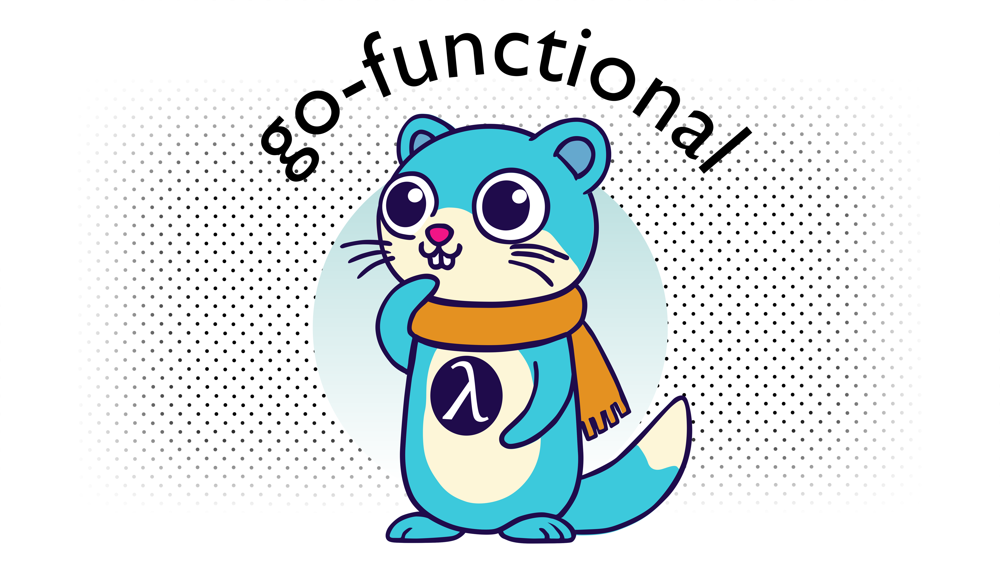

# Functional Programming in Go

[](https://github.com/BooleanCat/go-functional/releases)
[](https://github.com/BooleanCat/go-functional/actions)
[](https://pkg.go.dev/github.com/BooleanCat/go-functional/v2)
[](https://goreportcard.com/report/github.com/BooleanCat/go-functional/v2)
[](https://codecov.io/gh/BooleanCat/go-functional)

A library of iterators for use with [iter.Seq](https://pkg.go.dev/iter#Seq). Requires Go 1.23+.

```go
// The first 5 natural numbers
numbers := slices.Collect(
	it.Take(it.NaturalNumbers[int](), 5),
)

// All even numbers
evens := it.Filter(it.NaturalNumbers[int](), filter.IsEven)

// String representations of integers
numbers := it.Map(it.NaturalNumbers[int](), strconv.Itoa)
```

_[Reference documentation](https://pkg.go.dev/github.com/BooleanCat/go-functional/v2)_

<picture>
	<source media="(prefers-color-scheme: dark)" srcset="assets/banner_dark.png" />
	<source media="(prefers-color-scheme: light)" srcset="assets/banner_light.png" />
	
</picture>

## Installation

```terminal
go get github.com/BooleanCat/go-functional/v2@latest
```

## Overview

Most functions offered by this package are either consumers or iterators.

[Consumers](#consumers) will iterate over an iterator and completely or partially drain them of
values and (in most cases) collect the values into a data type.

[Iterators](#iterators) are functions that yield new values and can be ranged over. See Go's
documentation for iterators for more details.

## Consumers

The standard libary provides functions to collect iterators in the
[slices](https://pkg.go.dev/slices) and [maps](https://pkg.go.dev/maps) packages that should satisfy
most cases where collection is needed.

This package provides additional collection methods and makes existing consumers from the standard
library chainable.

<!-- prettier-ignore -->
> [!WARNING]
> Attempting to collect infinite iterators will cause an infinite loop and likely deadlock. Consider
> bounding infinite iterators before collect (for example using [Take](#take)).

### All & Any

`All` will return `true` if all values yielded by an iterator are `true`, or `false` otherwise.
Iteration will terminate early if `false` is encountered. Empty iterators will return `true`.

```go
it.All(slices.Values([]bool{true, false, true}))  // true
```

`Any` will return `true` if any value yielded by an iterator is `true`, or `false` otherwise.
Iteration will terminate early if `true` is encountered. Empty iterators will return `false`.

```go
it.Any(slices.Values([]bool{false, false, true}))  // true
```

<!-- prettier-ignore -->
> [!NOTE]
> The `itx` package does not contain `All` or `Any` due to limitations with Go's type system.

### Collect

In most cases [slices.Collect](https://pkg.go.dev/slices#Collect) from the standard library may be
used to collect items from an iterator into a slice. There are several other variants of collect
available for use for different use cases.

```go
// Chainable
numbers := itx.NaturalNumbers[int]().Take(5).Collect()

// Collect an iter.Seq2[V, W] into two slices
keys, values := it.Collect2(maps.All(map[string]int{"one": 1, "two": 2}))

// As above, but chainable
keys, values := itx.FromMap(map[string]int{"one": 1, "two": 2}).Collect()
```

<h3 id="trycollect">TryCollect & MustCollect</h3>

Dealing with iterators that return `T, error` can involve the boilerplate of checking that the
returned slice of errors only contains `nil`. `TryCollect` solves this by collecting all values into
a slice and returning a single error: the first one encountered.

```go
text := strings.NewReader("one\ntwo\nthree\n")

if lines, err := it.TryCollect(it.LinesString(text)); err != nil {
	fmt.Println(lines)
}
```

`MustCollect` is similar except that if an error is encountered then a panic will occur.

```go
text := strings.NewReader("one\ntwo\nthree\n")

lines := it.MustCollect(it.LinesString(text))
```

<!-- prettier-ignore -->
> [!TIP]
> Use `MustCollect` when you can guarantee that no error will occur (such as with
> [strings.Reader](https://pkg.go.dev/strings#Reader)).

<!-- prettier-ignore -->
> [!NOTE]
> If an error is encountered, collection stops. This means the iterator being collected may not be
> fully drained.

<!-- prettier-ignore -->
> [!NOTE]
> The `itx` package does not contain `TryCollect` or `MustCollect` due to limitations with Go's type
> system.

### ForEach

ForEach consumes an iterator and applies a function to each value yielded.

```go
it.ForEach(slices.Values([]int{1, 2, 3}), func(number int) {
	fmt.Println(number)
})

// Chainable
itx.FromSlice([]int{1, 2, 3}).ForEach(func(number int) {
	fmt.Println(number)
})

// For each member of an iter.Seq2
it.ForEach2(slices.All([]int{1, 2, 3}), func(index int, number int) {
	fmt.Println(index, number)
})

// As above, but chainable
itx.FromSlice([]int{1, 2, 3}).Enumerate().ForEach(func(index int, number int) {
	fmt.Println(index, number)
})
```

### Fold

Fold every element into an accumulator by applying a function and passing an initial value.

```go
it.Fold(slices.Values([]int{1, 2, 3}), op.Add, 0)

// Fold an iter.Seq2
it.Fold2(slices.All([]int{1, 2, 3}), func(i, a, b int) int {
	return i + 1
}, 0)
```

<!-- prettier-ignore -->
> [!TIP]
> The [op package](it/op/op.go) contains some simple, pre-defined operation functions.

<!-- prettier-ignore -->
> [!NOTE]
> The `itx` package does not contain `Fold` due to limitations with Go's type system.

### Max & Min

`Max` and `Min` consume an iterator and return the maximum or minimum value yielded and true if the
iterator contained at least one value, or the zero value and false if the iterator was empty.

The type of the value yielded by the iterator must be `comparable`.

```go
max, ok := it.Max(slices.Values([]int{1, 2, 3}))
min, ok := it.Min(slices.Values([]int{1, 2, 3}))
```

<!-- prettier-ignore -->
> [!NOTE]
> The `itx` package does not contain `Max` or `Min` due to limitations with Go's type system.

### Len

Len consumes an iterator and returns the number of values yielded.

```go
it.Len(slices.Values([]int{1, 2, 3}))

// Chainable
itx.FromSlice([]int{1, 2, 3}).Len()

// Len of an iter.Seq2
it.Len2(slices.All([]int{1, 2, 3}))

// As above, but chainable
itx.FromSlice([]int{1, 2, 3}).Enumerate().Len()
```

### Find

Find consumes an iterator until a value is found that satisfies a predicate. It returns the value
and true if one was found, or the zero value and false if the iterator was exhausted before a value
was found.

```go
found, ok := it.Find(slices.Values([]int{1, 2, 3}), func(i int) bool {
	return i == 2
})

// Chainable
value, ok := itx.FromSlice([]int{1, 2, 3}).Find(func(number int) bool {
	return number == 2
})

// Finding within an iter.Seq2
index, value, ok := it.Find2(slices.All([]int{1, 2, 3}), func(i, v int) bool {
	return i == 2
})

// As above, but chainable
index, value, ok := itx.FromSlice([]int{1, 2, 3}).Enumerate().Find(func(index int, number int) bool {
	return index == 1
})
```

<!-- prettier-ignore -->
> [!TIP]
> The [filter package](it/filter/filter.go) contains some simple, pre-defined predicate functions.

### Contains

Contains consumes an iterator until the provided value is found, returning true if the value was
found or false if the iterator was exhausted.

```go
ok := it.Contains(slices.Values([]int{1, 2, 3}), 2)
```

<!-- prettier-ignore -->
> [!NOTE]
> The `itx` package does not contain `Contains` due to limitations with Go's type system.

### From, FromSlice, FromMap & Seq

The itx package contains some helper functions to convert iterators, slices or maps directly into
chainable iterators to avoid some boilerplate.

```go
itx.From(slices.Values([]int{1, 2, 3})).Collect()

itx.From2(maps.All(map[int]string{1: "one"}))

itx.FromSlice([]int{1, 2, 3}).Collect()

itx.FromMap(map[int]int{1: 2}).Collect()
```

The `itx` package also contains a helper function Seq that will convert a chainable iterator into an
[iter.Seq](https://pkg.go.dev/iter#Seq) so that it can be used in functions that accept that type
(such as the standard library).

The standard library functions that work with iterators (such as
[slices.Collect](https://pkg.go.dev/slices#Collect)) accept the
[iter.Seq](https://pkg.go.dev/iter#Seq) family of types. This precludes those functions from
accepting types with another alias (such as `itx.Iterator`) with the same type definition. This
means it is necessary to "covert" an `itx.Iterator` into an [iter.Seq](https://pkg.go.dev/iter#Seq)
before passing the iterator into those functions.

```go
slices.Collect(itx.NaturalNumbers[int]().Take(3).Seq())
```

<!-- prettier-ignore -->
> [!TIP]
> go-functional's functions that accept iterators always accept `func(func(V) bool)` or
> `func(func(V, W) bool)` rather than any specific type alias so that they can accept any type alias
> with the definitions [iter.Seq](https://pkg.go.dev/iter#Seq),
> [iter.Seq2](https://pkg.go.dev/iter#Seq2), `itx.Iterator`, `itx.Iterator2` or any other
> third-party types aliased to the same type.

### ToChannel

ToChannel sends yielded values to a channel.

The channel is closed when the iterator is exhausted. Beware of leaked go routines when using this
function with an infinite iterator.

```go
channel := it.ToChannel(slices.Values([]int{1, 2, 3}))

for number := range channel {
	fmt.Println(number)
}

// Chainable
channel := itx.FromSlice([]int{1, 2, 3}).ToChannel()

for number := range channel {
	fmt.Println(number)
}
```

<!-- prettier-ignore -->
> [!NOTE]
> Unlike most consumers, the iterator is not immediately consumed by ToChannel. Instead is it
> consumed as values are pulled from the channel.

### Drain

Drain consumes an iterator's values and drops them.

```go
printValue := func(n int) int {
	fmt.Println(n)
	return n
}

it.Drain(it.Map(slices.Values([]int{1, 2, 3}), printValue))

// Chainable
itx.From(it.Map(slices.Values([]int{1, 2, 3}), printValue)).Drain()

// Drain an iter.Seq2
printValue2 := func(i, n int) (int, int) {
	fmt.Println(n)
	return i, n
}

it.Drain2(it.Map2(slices.All([]int{1, 2, 3}), printValue2))

// As above, but chainable
itx.From2(it.Map2(slices.All([]int{1, 2, 3}), printValue2)).Drain()
```

<!-- prettier-ignore -->
> [!TIP]
> Use `Drain` to consume an iterator to invoke any side effects when you don't need to collect the
> values.

## Iterators

This library contains two kinds of iterators in the `it` and `itx` packages. In most cases you'll
find the same iterators in each package, the difference between them being that the iterators in the
`itx` package can be "dot-chained" (e.g. `iter.Filter(...).Take(3).Collect()`) and those in `it`
cannot.

Iterators within the `it` package are of the type [iter.Seq](https://pkg.go.dev/iter#Seq) or
[iter.Seq2](https://pkg.go.dev/iter#Seq2) (from the standard library). Iterators within the `itx`
package are of the type `itx.Iterator[V]` or `itx.Iterator2[V, W]`.

There are two important factors to consider when using iterators:

1. Some iterators yield an infinite number of values and care should be taken to avoid consuming
   (using functions such as [slices.Collect](https://pkg.go.dev/slices#Collect)) otherwise it's
   likely to cause an infinite while loop.
2. Many iterators take another iterator as an argument (such as [Filter](#filter) or Map). Avoid
   using an iterator after it has been passed to another iterator otherwise you'll risk multiple
   functions consuming a single (likely not thread-safe) iterator and causing confusing and
   difficult to debug behaviour.

### Chain

Chain yields values from multiple iterators in the sequence they are provided in. Think of it as
glueing many iterators together.

When provided zero iterators it will behave like [Exhausted](#exhausted).

```go
numbers := it.Chain(slices.Values([]int{1, 2}), slices.Values([]int{3, 4}))

pairs := itx.FromSlice([]int{1, 2}).Chain(slices.Values([]int{3, 4}))

pairs := it.Chain2(maps.All(map[string]int{"a": 1}), maps.All(map[string]int{"b": 2}))

pairs := itx.FromMap(map[string]int{"a": 1}).Chain(maps.All(map[string]int{"b": 2}))
```

### FromChannel

FromChannel pulls values from a channel and yields them via an iterator. The usual concerns around
channel deadlocks apply here.

The iterator is exhausted when the channel is closed and it is the responsibility of the caller to
close the channel.

```go
items := make(chan int)

go func() {
	defer close(items)
	items <- 1
	items <- 2
}()

for number := range it.FromChannel(items) {
	fmt.Println(number)
}

// Chainable
items := make(chan int)

go func() {
	defer close(items)
	items <- 1
	items <- 0
}()

for number := range itx.FromChannel(items).Exclude(filter.IsZero) {
	fmt.Println(number)
}
```

<!-- prettier-ignore -->
> [!WARNING]
> In order to prevent a deadlock, the channel must be closed before attemping to stop the iterator
> when it's used in a pull style. See [iter.Pull](https://pkg.go.dev/iter#Pull).

### Compact

Compact yields all values from a delegate iterator that are not zero values. It is functionally
equivalent to `it.Exclude(delegate, filter.IsZero)`.

```go
words := it.Compact(slices.Values([]string{"foo", "", "bar", "", ""}))
```

<!-- prettier-ignore -->
> [!NOTE]
> The `itx` package does not contain `Compact` due to limitations with Go's type system.

### Cycle

Cycle yields all values from an iterator before returning to the beginning and yielding all values
again (indefinitely).

```go
numbers := it.Take(it.Cycle(slices.Values([]int{1, 2})), 5)

// Chainable
numbers := itx.FromSlice([]int{1, 2}).Cycle().Take(5)

// Cycling an iter.Seq2
numbers := it.Take2(it.Cycle2(maps.All(map[int]string{1: "one"})), 5)

// As above, but chainable
numbers := itx.FromMap(map[int]string{1: "one"}).Cycle().Take(5)
```

<!-- prettier-ignore -->
> [!NOTE]
> Since cycle needs to store all values yielded in memory, its memory usage will grow as the first
> cycle is consumed and remain at a constant size on subsequent cycles.

<!-- prettier-ignore -->
> [!WARNING]
> This iterator yields an infinite number of values and care should be taken when consuming it
> otherwise it's likely to result in an infinite while loop. Consider bounding the size of the
> iterator before consuming (e.g. using [Take](#take)).

<h3 id="drop">Drop & DropWhile</h3>

Drop yields all values from a delegate iterator after dropping a number of values from the
beginning. Values are not dropped immediately, but when consumption begins.

When dropping a number of values larger than the length of the iterator, it behaves like
[Exhausted](#exhausted).

```go
numbers := it.Drop(slices.Values([]int{1, 2, 3, 4, 5}), 2)

// Chainable
numbers := itx.FromSlice([]int{1, 2, 3, 4, 5}).Drop(2)

// Dropping on iter.Seq2
numbers := it.Drop2(maps.All(map[int]string{1: "one", 2: "two", 3: "three"}), 1)

// As above, but chainable
numbers := itx.FromMap(map[int]string{1: "one", 2: "two", 3: "three"}).Drop(1)
```

DropWhile drops values from the provided iterator whilst the predicate returns true for each value.
After the first value results in the predicate returning false, the iterator resumes as normal.

```go
slices.Collect(it.DropWhile(slices.Values([]int{1, 2, 3, 4, 5}), filter.LessThan(3)))

// Chainable
itx.FromSlice([]int{1, 2, 3, 4, 5}).DropWhile(filter.LessThan(3)).Collect()

lessThanThree := func(string, number int) { return number < 3 }

// Taking from iter.Seq2
maps.Collect(it.DropWhile2(maps.All(map[string]int{"one": 1, "four": 4}), lessThanThree))

// As above, but chainable
itx.FromMap(map[string]int{"one": 1, "four": 4}).DropWhile(lessThanThree).Collect()
```

### Enumerate

Enumerating an [iter.Seq](https://pkg.go.dev/iter#Seq) like iterator returns an
[iter.Seq2](https://pkg.go.dev/iter#Seq2) like iterator yielding the index of each value and the
value.

```go
indexedValues := it.Enumerate(slices.Values([]int{1, 2, 3}))

// Chainable
indexedValues := itx.FromSlice([]int{1, 2, 3}).Enumerate()
```

<!-- prettier-ignore -->
> [!TIP]
> When iterating over a slice and immediately enumerating, consider instead using the standard
> library's [slices.All](https://pkg.go.dev/slices#All) function rather than this.

### Exhausted

Exhausted is an iterator that yields no values.

```go
slices.Collect(it.Exhausted[int]())

// Chainable
it.Exhausted[int]().Collect()

// Exhausted iter.Seq2
maps.Collect(it.Exhausted2[int, string]())

// As above, but chainable
itx.Exhausted2[int, string]().Collect()
```

<h3 id="filter">Filter & Exclude</h3>

Filter yields values from an iterator that satisfy a predicate. Likewise, exclude yields values from
an iterator that do not satisfy a predicate.

```go
it.Filter(slices.Values([]int{1, 2, 3, 4, 5}), filter.IsEven)
it.Exclude(slices.Values([]int{1, 2, 3, 4, 5}), filter.IsEven)

// Chainable
itx.FromSlice([]int{1, 2, 3, 4, 5}).Filter(filter.IsEven)
itx.FromSlice([]int{1, 2, 3, 4, 5}).Exclude(filter.IsEven)

// Filtering an iter.Seq2
isOne := func(n int, _ string) bool { return n == 1 }

it.Filter2(maps.All(map[int]string{1: "one", 2: "two", 3: "three"}), isOne)
it.Exclude2(maps.All(map[int]string{1: "one", 2: "two", 3: "three"}), isOne)

// As above, but chainable
itx.FromMap(map[int]string{1: "one", 2: "two", 3: "three"}).Filter(isOne)
itx.FromMap(map[int]string{1: "one", 2: "two", 3: "three"}).Exclude(isOne)
```

<!-- prettier-ignore -->
> [!TIP]
> The [filter package](it/filter/filter.go) contains some simple, pre-defined predicate functions.

### FilterError & ExcludeError

Similar to [Filter and Exclude](#filter), these functions filter values from an iterator using a
predicate that may return an error.

```go
isFoo := func(s string) (bool, error) { return s == "foo", nil }

values, err := it.TryCollect(it.FilterError(slices.Values([]string{"foo", "bar"}), isFoo))
values, err := it.TryCollect(it.ExcludeError(slices.Values([]string{"foo", "bar"}), isFoo))

// Chainable
values, err := it.TryCollect(itx.FromSlice([]int{"foo", "bar"}).FilterError(isFoo))
values, err := it.TryCollect(itx.FromSlice([]int{"foo", "bar"}).ExcludeError(isFoo))
```

### Integers

Integers yields all integers in the range [start, stop) with the given step.

```go
for i := range it.Integers[uint](0, 3, 1) {
	fmt.Println(i)
}

// Chainable
for i := range itx.Integers[uint](0, 3, 1).Drop(1) {
	fmt.Println(i)
}
```

### Lines & LinesString

Lines yields lines from an [io.Reader](https://pkg.go.dev/io#Reader). Lines are split using the
standard library's [bufio.Scanner](https://pkg.go.dev/bufio#Scanner). Each value yielded from the
iterator is a line from the provided reader. Empty lines will result in empty values.

Since reading from an [io.Reader](https://pkg.go.dev/io#Reader) can fail, each line is returned with
a corresponding `error` value.

LinesString behaves exactly like Lines except that its values are strings rather than byte slices.

```go
buffer := strings.NewReader("one\ntwo\nthree\n")

for line, err := range it.Lines(buffer) {
	if err != nil {
		fmt.Println(err)
		break
	}

	fmt.Println(string(line))
}

for line, err := range it.LinesString(buffer) {
	if err != nil {
		fmt.Println(err)
		break
	}

	fmt.Println(line)
}
```

<!-- prettier-ignore -->
> [!TIP]
> Consider using [TryCollect](#trycollect) in conjunction with Lines to make error collection less
> cumbersome:
>
> ```go
> lines, err := it.TryCollect(it.LinesString(buffer))
> ```

<!-- prettier-ignore -->
> [!TIP]
> For cases where errors will never result from reading, such as with
> [bytes.Buffer](https://pkg.go.dev/bytes#Buffer), consider dropping the error value before
> collection:
>
> ```go
> lines := itx.LinesString(buffer).Left().Collect()
> ```

<!-- prettier-ignore -->
> [!WARNING]
> As with [bufio.Scanner](https://pkg.go.dev/bufio#Scanner), there is a maximum line length per line
> of 65536 characters.

<h3 id="map">Map & Transform</h3

Map yields values from an iterator that have had the provided function applied to each value.
Transform serves the same purpose but contrains the return type to the type of the iterator's values
(see note below).

```go
double := func(n int) int { return n * 2 }

it.Map(slices.Values([]int{1, 2, 3}), double)

// Map for iter.Seq2
doubleBoth := func(n, m int) (int, int) { return n * 2, m * 2 }

it.Map2(maps.All(map[int]int{1: 2, 3: 4}), doubleBoth)

// Limited chainable flavour of Map
itx.FromSlice([]int{0, 1, 2}).Transform(double)

// As above for iter.Seq2
itx.FromMap(map[int]int{1: 2}).Transform(doubleBoth)
```

<!-- prettier-ignore -->
> [!NOTE]
> The `itx` package does not contain `Map` due to limitations with Go's type system. Instead a
> limited from of `Map` called `Transform` is provided where the type returned from operations is
> the same as a type of the iterator's values.
>
> A chainable Map will be added should Go's type system ever support new generic type parameters on
> methods.

<!-- prettier-ignore -->
> [!TIP]
> If you wish to chain operations on `Map`, you can do so by first converting it to an
> `itx.Iterator` like so:
>
> ```go
> itx.From(it.Map(slices.Values([]int{1, 2, 3}), double)).Collect()
> ```

### MapError & TransformError

`MapError` and `TransformError` behave like [Map and Transform](#map) except that they accept a
function that may return an error.

```go
double := func(n int, err error) int { return n * 2, nil }

it.MapError(slices.Values([]int{1, 2, 3}), double)

// Limited chainable flavour of MapError
itx.FromSlice([]int{1, 2, 3}).TransformError(double)
```

<!-- prettier-ignore -->
> [!NOTE]
> The `itx` package does not contain `MapError` due to limitations with Go's type system. Instead a
> limited from of `MapError` called `TransformError` is provided where the type returned from
> operations is the same as a type of the iterator's values.
>
> A chainable MapError will be added should Go's type system ever support new generic type
> parameters on methods.

<!-- prettier-ignore -->
> [!TIP]
> If you wish to chain operations on `MapError`, you can do so by first converting it to an
> `itx.Iterator2` like so:
>
> ```go
> itx.From2(it.MapError(slices.Values([]int{1, 2, 3}), double)).Collect()
> ```

### NaturalNumbers

NaturalNumbers yields all non-negative integers in ascending order.

```go
for i := range it.Take(it.NaturalNumbers[int](), 3) {
	fmt.Println(i)
}

// Chainable
for i := range itx.NaturalNumbers[int]().Take(3) {
	fmt.Println(i)
}
```

<!-- prettier-ignore -->
> [!WARNING]
> This iterator yields an infinite number of values and care should be taken when consuming it
> otherwise it's likely to result in an infinite while loop. Consider bounding the size of the
> iterator before consuming (e.g. using [Take](#take)).

<!-- prettier-ignore -->
> [!WARNING]
> There is no protection against overflowing whatever integer type is used for this iterator.

### Once

Once yields the provided value once before being exhausted.

```go
slices.Collect(it.Once(42))

// Chainable
itx.Once(42).Collect()

// For iter.Seq2
maps.Collect(it.Once2(42, "42"))

// As above, but chainable
itx.Once(42, "42").Collect()
```

### Repeat

Repeat yields the same value indefinitely.

```go
slices.Collect(it.Take(it.Repeat(42), 5))

// Chainable
itx.Repeat(42).Take(5).Collect()

// For iter.Seq2
maps.Collect(it.Take2(it.Repeat(42, "42"), 5))

// As above, but chainable
itx.Repeat2(42, "42").Take(5).Collect()
```

<!-- prettier-ignore -->
> [!WARNING]
> This iterator yields an infinite number of values and care should be taken when consuming it
> otherwise it's likely to result in an infinite while loop. Consider bounding the size of the
> iterator before consuming (e.g. using [Take](#take)).

<h3 id="take">Take & TakeWhile</h3>

Take limits the number of values of an iterator to a specified size. If the iterator has fewer
values than the provided number then it behaves as though the original iterator is not changed.

```go
slices.Collect(it.Take(slices.Values([]int{1, 2, 3}), 2))

// Chainable
itx.FromSlice([]int{1, 2, 3}).Take(2).Collect()

// Taking from iter.Seq2
maps.Collect(it.Take2(slices.All([]int{1, 2, 3}), 2))

// As above, but chainable
itx.FromSlice([]int{1, 2, 3}).Enumerate().Take(2).Collect()
```

TakeWhile yields values from the provided iterator whilst the predicate returns true for each value.
After the first value results in the predicate returning false, the iterator is exhausted.

```go
slices.Collect(it.TakeWhile(slices.Values([]int{1, 2, 3}), filter.LessThan(3)))

// Chainable
itx.FromSlice([]int{1, 2, 3}).TakeWhile(filter.LessThan(3)).Collect()

lessThanThree := func(string, number int) { return number < 3 }

// Taking from iter.Seq2
maps.Collect(it.TakeWhile2(maps.All(map[string]int{"one": 1, "four": 4}), lessThanThree))

// As above, but chainable
itx.FromMap(map[string]int{"one": 1, "four": 4}).TakeWhile(lessThanThree).Collect()
```

### Zip, Left & Right

`Zip` yields pairs of values from two iterators. It is exhausted when one of the two provided
iterators is exhausted.

```go
numbers := []int{1, 2, 3}
strings := []string{"one", "two", "three"}

maps.Collect(it.Zip(slices.Values(numbers), slices.Values(strings)))
```

`Left` and `Right` are functions that discard the left or right values of an
[iter.Seq2](https://pkg.go.dev/iter#Seq2).

```go
slices.Collect(it.Left(slices.All([]int{1, 2, 3})))
slices.Collect(it.Right(slices.All([]int{1, 2, 3})))

// Chainable
itx.FromSlice([]int{1, 2, 3}).Enumerate().Left().Collect()
itx.FromSlice([]int{1, 2, 3}).Enumerate().Right().Collect()
```

<!-- prettier-ignore -->
> [!TIP]
> A common pattern when working with `Zip` iterators in other languages is to fill excess values
> with some constant value. This pattern can easily to replicated here by using [Chain](#chain) and
> [Repeat](#repeat):
>
> ```go
> numbers := itx.FromSlice([]int{1, 2, 3, 4})
> strings := itx.FromSlice([]string{"one", "two"})
>
> it.Zip(numbers, strings.Chain(it.Repeat("missing")))
> ```

<!-- prettier-ignore -->
> [!NOTE]
> The `itx` package does not contain `Zip` due to limitations with Go's type system.

## Attributions

In addition to those listed as code contributors on this repository, I'd like to also thank:

- [**_Henry Wong_**](https://www.behance.net/henrywong) for designing the banner images and
  stickers.
